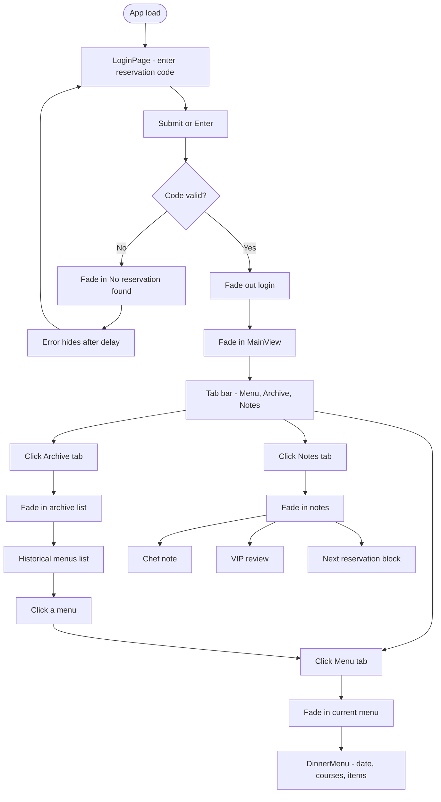

# Cafe 307

Private dining menu app. Enter a reservation code to view the dinner menu, archive of past menus, and chef/guest notes.

## Tech stack

- **Frontend:** React, Vite, prop-types
- **Backend:** FastAPI, SQLite, SQLAlchemy (in `backend/`). The app fetches the current menu from the API and falls back to static `data/currentMenu.js` if the API is unavailable.

## How to run

**Backend (API + DB)** — from the repo root:

```bash
# Optional: seed the DB with the current menu from data/currentMenu.js
python3 -m backend.seed_menu

# Start the API (default http://127.0.0.1:8001)
python3 -m uvicorn backend.main:app --host 0.0.0.0 --port 8001
```

**Frontend:**

```bash
npm install
npm run dev
```

Set `VITE_API_BASE` to your API URL if different (e.g. `http://127.0.0.1:8001`). The frontend uses this for `GET /api/menus/current` and, when logged in as **vivian**, for updating the menu via the Add menu tab.

**Vivian:** Logging in with reservation code **vivian** shows an extra **Add menu** tab. Use it to add or edit the current menu. In the **Archive** tab, each menu row has an **Edit** button; clicking it opens the Add menu form with that menu loaded; save updates that menu in place (current or archived). To restore a menu from an HTML file (e.g. a saved dinner menu page), run: `python3 -m backend.restore_from_html "/path/to/file.html"` (backend must be running; the menu is added to the archive).

Build for production:

```bash
npm run build
```

Valid login codes are in `data/loginConstants.js` (e.g. vlad, mushu, vivian, gelato, caramel, tangyuan).

---

## Tutorial: How the app works

This walkthrough is for anyone new to React. We'll go through the app screen by screen and point to the exact files and ideas that make it work. You'll see how **state**, **components**, and **props** work in a real app.

The diagram below shows the path a user can take: from the login screen, to the main dashboard, and then to the Menu, Archive, or Notes tab.

### User flow (overview)



---

### 1. Understanding the login page

When you first open the app, you see a single input asking for a "reservation code" and an Enter button. If you type a wrong code and press Enter, the message "No reservation found" appears for a few seconds, then disappears.

Here's how that works in the code. In React, **state** is data that can change over time; when it changes, the screen updates. The top-level component lives in **src/cafe307.jsx**. It keeps a piece of state called `loggedIn`. When `loggedIn` is false, the app shows the login screen. When it becomes true, the app shows the main dashboard instead. So "logging in" simply means: something sets `loggedIn` to true. That something is a function called `handleSubmitLogin`. When you enter a valid code, the login screen calls this function (which the parent passed down as a prop), and the parent then sets `loggedIn` to true after a short fade. You can see the fade duration in **data/animationConstants.js** under `LOGIN_FADE_DURATION_MS`.

The login screen itself is its own component in **components/LoginPage.jsx**. That component keeps two pieces of state: `code` (whatever you typed) and `err` (whether to show the "No reservation found" message). When you click Enter or the button, a function called `handleSubmit` runs. It checks whether the trimmed, lowercased `code` is in a list of valid codes that come from **data/loginConstants.js** (`VALID_LOGIN_CODES`). If it is, the component calls `onLogin()`, which is the parent's `handleSubmitLogin`. If it isn't, it sets `err` to true so the error message appears, and then after a few seconds (controlled by `ERROR_DISPLAY_MS` in the same file) it sets `err` back to false so the message goes away.

A nice way to see that this is all wired up is to open **data/loginConstants.js**, add or change one of the valid codes, and try logging in again. You can also change `ERROR_DISPLAY_MS` to see the error message stay on screen for a longer or shorter time.

---

### 2. Understanding the menu dashboard (MainView)

After you log in, you see one screen with a header ("Cafe 307", "Welcome back"), three tabs (Menu, Archive, Notes), and a content area that changes when you click a tab. This whole screen is one component called MainView, which lives in **components/MainView.jsx**.

MainView uses a single piece of state called `tab`. Its value is one of the strings `"menu"`, `"archive"`, or `"notes"`. The three tab buttons each call `setTab` with the right id when you click them. The content below the tabs is chosen with simple conditionals: if `tab === "menu"` the app shows the current dinner menu; if `tab === "archive"` it shows the list of past menus; if `tab === "notes"` it shows the chef note, guest review, and next reservation. So there aren't three separate "pages"—there's one component that shows different content depending on the value of `tab`. This is a common pattern in React: one state variable drives what the user sees.

If you're new to React, it helps to open **components/MainView.jsx** and find where `tab` is defined with `useState`, and then search for the three places that check `tab === "menu"`, `tab === "archive"`, and `tab === "notes"`. You'll see how that one state controls all three views.

---

### 3. What happens when you click the Archive tab

When you click the Archive tab, you see a list titled "Past Menus." Each row shows a menu's date, lunar date, label, and a short summary of dishes. If you click a row, the app switches you back to the Menu tab.

That list is built in **components/MainView.jsx** inside the block that runs when `tab === "archive"`. The list comes from a variable called `allMenusForArchive`, which is defined at the top of MainView as the current menu plus the list of past menus: `[currentMenu, ...archivedMenus]`. So the archive shows the one "featured" menu and any older menus. Each row displays the menu's date, lunar date, label, and a summary line that's made by taking all the courses and their items and joining the Chinese dish names with a dot. The row has an `onClick` handler that simply calls `setTab("menu")`, so clicking a row doesn't load that menu's full detail yet—it just switches the tab back to Menu, which always shows the same featured menu. The featured menu is defined in **data/currentMenu.js**, and the list of past menus is in **data/archivedMenus.js** (right now that list is empty, so you only see the current menu in the archive).

To get a feel for how the data and UI are connected, you can add a second menu object to **data/archivedMenus.js** using the same shape as the menu in **data/currentMenu.js**. When you open the Archive tab again, you should see your new menu in the list.

---

### 4. What happens when you click the Notes tab

When you click the Notes tab, you see three blocks: a Chef's note, a Guest review, and a "Next reservation" section (e.g. Thursday, party size, "always confirmed").

All of that is still inside **components/MainView.jsx**, in the block that runs when `tab === "notes"`. The chef's note text comes from a function called `getChefNote(currentMenu.date)`, which is imported from **data/chefsNotes.js**. The guest review comes from `getVipReview(currentMenu.date)`, which is imported from **data/vipReviews.js**. The "Next reservation" part is static text for now. So the Notes tab doesn't store notes inside the menu objects; instead, notes and reviews are stored in separate files and linked to a menu by its date. Whenever you're on the Notes tab, the app shows the chef note and VIP review for **the current menu's date** (the date of the featured menu in **data/currentMenu.js**).

In **data/chefsNotes.js** you'll find an array of objects with `menuDate` and `note`, and a function `getChefNote(menuDate)` that looks up the note for that date. **data/vipReviews.js** is similar: objects with `menuDate` and `review`, and a function `getVipReview(menuDate)`. If you add another chef note with a different `menuDate`, you'll see that the Notes tab still only shows the note that matches the current menu's date. Later you could add state for "which menu is selected" (e.g. from the Archive) and pass that menu's date into `getChefNote` and `getVipReview` so the Notes tab can show notes for the menu the user picked.

---

### 5. Refactoring with FastAPI (same UI, backend data)

Right now all the data (menus, chef notes, VIP reviews, valid login codes) lives in JavaScript files under the `data/` folder and is bundled with the app. You can keep the same React UI and user flows and instead load that data from a backend. This section gives you a simple way to think about that using FastAPI.

You would expose the same information as HTTP endpoints. For example: a POST endpoint to validate the login code (e.g. `POST /auth/validate` or `POST /login` with a body like `{ "code": "vivian" }` returning 200 or 401); a GET endpoint for the current menu (e.g. `GET /menus/current` returning one menu object); a GET for the list of past menus (e.g. `GET /menus/archive`); and GETs for the chef note and VIP review by menu date (e.g. `GET /notes/chef?menu_date=...` and `GET /reviews/vip?menu_date=...`). Your React app would then call these endpoints (e.g. with `fetch`) instead of importing from the `data/` files.

On the FastAPI side, you'd define models that match your menu and note shapes, implement those routes (using in-memory data or a database), and enable CORS so the browser allows requests from your React dev server (e.g. `http://localhost:5173`). On the React side, you'd add a small layer (e.g. functions in `api/menus.js`, `api/notes.js`) that call `fetch` and return the JSON. In your components, you'd stop importing the static data and instead fetch it when the app or a screen loads, and store it in state. For login, you'd send the code to your backend and, if the response is successful, call the same `onLogin()` (or `handleSubmitLogin`) that you use today so the rest of the app doesn't need to change.

A good way to try this is to implement one endpoint first (e.g. `GET /menus/current`), call it from React when the app loads, put the result in state, and pass it into the same components that currently use the imported menu. Once that works, you can add the other endpoints (login, archive, notes) so the behavior matches what you learned in the tutorial above.

---

## Project structure (reference)

Here's a quick reference for where everything lives so you can jump to the right file while you're learning.

| Path | Role |
|------|------|
| `src/cafe307.jsx` | Root App; login vs MainView routing |
| `src/main.jsx` | Entry; mounts App to the DOM |
| `data/theme.js` | Colors and fonts |
| `data/animationConstants.js` | Fade/stagger timing |
| `data/loginConstants.js` | Valid codes and error display duration |
| `data/currentMenu.js` | Featured menu for the Menu tab |
| `data/archivedMenus.js` | Past menus for the Archive tab |
| `data/chefsNotes.js` | Chef notes; `getChefNote(menuDate)` |
| `data/vipReviews.js` | VIP reviews; `getVipReview(menuDate)` |
| `components/LoginPage.jsx` | Login screen |
| `components/MainView.jsx` | Dashboard with tabs and tab content |
| `components/DinnerMenu.jsx` | Menu card (date, courses, items) |
| `components/FadeIn.jsx` | Fade-in + slide-up wrapper |
| `components/SectionDivider.jsx` | Line-dot-line divider between sections |
